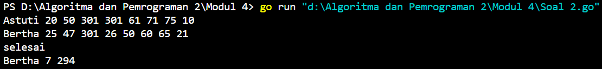
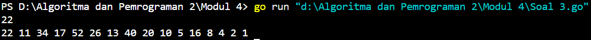

<h1 align="center">Laporan Praktikum Modul 4 <br>Prosedur</h1>
<p align="center">FAKHRI NAABIL PRASETYO - 103112400274</p> 

### Soal 1
```go
package main

import "fmt"

// Proedur untuk menghitung nilai faktorial
func factorial(n int, hasil *int) {
	*hasil = 1
	for i := 1; i <= n; i++ {
		*hasil *= i
	}
}

// Proedur untuk menghitung nilai permutasi
func permutation(n, r int, hasil *int) {
	var faktorialN, faktorialNR int

	// menggunakan prosedur factorial untuk menghitung faktorial dari n, r maupun n-r
	factorial(n, &faktorialN)
	factorial(n-r, &faktorialNR)
	*hasil = faktorialN / faktorialNR
}

// Proedur untuk menghitung nilai kombinasi
func combination(n, r int, hasil *int) {
	var faktorialN, faktorialR, faktorialNR int

	// menggunakan prosedur factorial untuk menghitung faktorial dari n, r maupun n-r
	factorial(n, &faktorialN)
	factorial(r, &faktorialR)
	factorial(n-r, &faktorialNR)
	*hasil = faktorialN / (faktorialR * faktorialNR)
}

func main() {
	var a, b, c, d, permutationA, permutationB, combinationA, combinationB int
	fmt.Scan(&a, &b, &c, &d)

	if a >= c && b >= d {
		permutation(a, c, &permutationA)
		combination(a, c, &combinationA)
		permutation(b, d, &permutationB)
		combination(b, d, &combinationB)
		fmt.Println(permutationA, combinationA)
		fmt.Println(permutationB, combinationB)
	} else {
		fmt.Print("Input tidak valid")
	}

}
```


#### Penjelasan  :
Ketika program berjalan, program akan meminta untuk memasukan 4 bilangan asli yang masing-masing disimpan pada variabel a, b, c dan d, dan ada beberapa syarat yang harus dipenuhi, yaitu 𝑎 ≥ 𝑐 dan 𝑏 ≥ 𝑑. Kemudian akan terdapat beberapa proses, yaitu faktorial, permutasi dan kombinasi. Untuk output yang dihasilkan adalah permutasi dan kombinasi a terhadap c, sedangkan baris kedua adalah hasil permutasi dan kombinasi b terhadap d.


### Soal 2
```go
package main

import "fmt"

// Prosedur untuk menghitung jumlah soal yang dijawab dan total skor
func hitungSkor(soal, skor *int) {
	var time int

	// Mendefinisikan nilai dari soal dan skor awal adalah 0
	*soal = 0
	*skor = 0

	// Perulangan yang akan berjalan sebanyak 8 kali
	for i := 0; i < 8; i++ {
		fmt.Scan(&time)
		if time < 301 {
			*soal++
			*skor += time
		}
	}
}

func main() {

	var nama, pemenang string
	var soal, skor, maksimumSoal, minimumSkor int

	maksimumSoal = -1
	minimumSkor = 99999

	for {
		fmt.Scan(&nama)

		if nama == "Selesai" || nama == "selesai" {
			break
		}

		hitungSkor(&soal, &skor)

		// Jika jumlah soal sama, pemenang adalah yang memiliki skor lebih kecil (lebih cepat menyelesaikan soal)
		if soal > maksimumSoal || (soal == maksimumSoal && skor < minimumSkor) {
			maksimumSoal = soal
			minimumSkor = skor
			pemenang = nama
		}
	}

	fmt.Println(pemenang, maksimumSoal, minimumSkor)
}
```


#### Penjelasan  :
Program ini akan menentukan pemenang dari sebuah kompetisi pemrograman berdasarkan jumlah soal dan waktu pengerjaan. Terdapat perulangan yang berhenti ketika sudah 8 kali perulangan, yaitu sesuai dengan jumlah soal yang dikerjakan masing-masing peserta, yaitu 8 soal. Dan untuk batas pengerjaan masing-masing soal adalah 5 jam, dan di program terangkan bahwa jika lebih dari 300 menit, maka dianggap sudah melebihi batas waktu yang ditentukan.


### Soal 3
```go
package main

import "fmt"

// Prosedur untuk mencetak deret dari suatu angka
func cetakDeret(n int) {
	for {
		fmt.Print(n, " ")
		if n == 1 {
			break
		}

		if n%2 == 0 {
			n /= 2
		} else {
			n = n*3 + 1
		}
	}
}

func main() {

	var n int
	fmt.Scan(&n)

	if n > 0 && n < 1000 {
		cetakDeret(n)
	}

}
```


#### Penjelasan  :
Program ini digunakan untuk mencetak deret angka berdasarkan aturan ketika genap, maka bilangan atau nilai n akan dikali dengan 1/2, jika ganjil dengan 3n + 1. Program diawali dengan membaca sebuah bilangan bulat positif n dari input, dengan batasan 1 hingga 999. Jika input memenuhi syarat, prosedur cetakDeret dipanggil untuk mencetak deretnya. Deret akan dicetak dari nilai n hingga 1.
