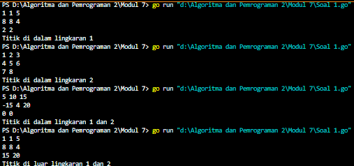
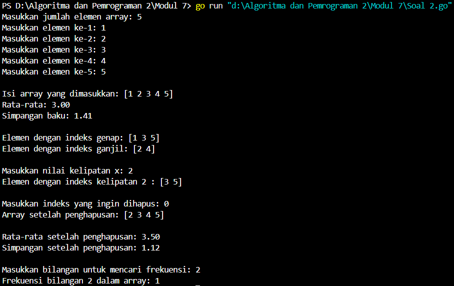
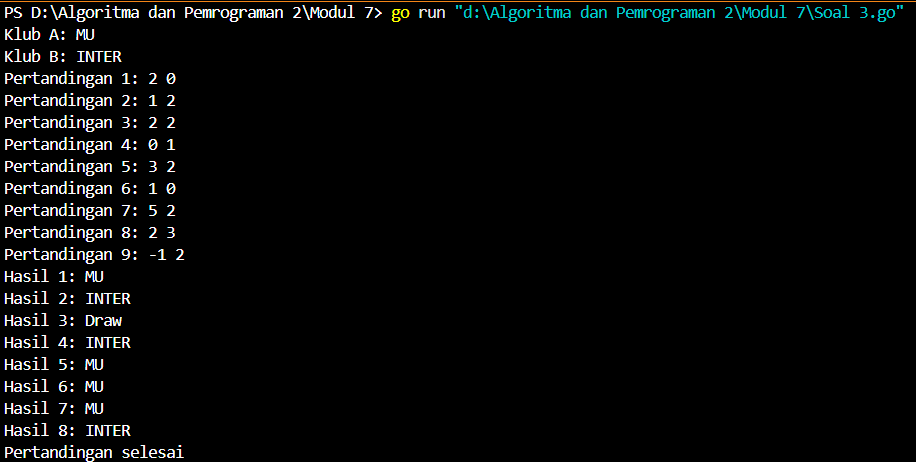
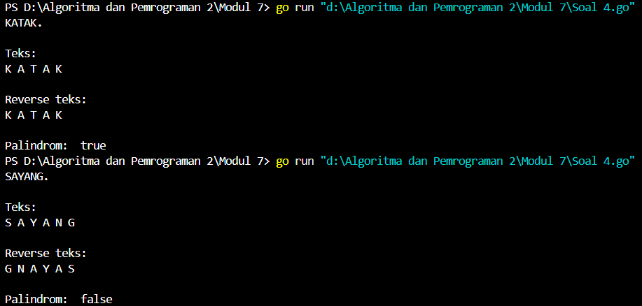

<h1 align="center">Laporan Praktikum Modul 7 <br>Struct & Array</h1>
<p align="center">FAKHRI NAABIL PRASETYO - 103112400274</p>


## Dasar Teori
Struct dan Array adalah dua struktur data dasar dalam pemrograman Golang. Array digunakan untuk menyimpan kumpulan elemen dengan tipe data yang sama dalam satu variabel, diakses menggunakan indeks, dan memiliki ukuran tetap yang ditentukan saat deklarasi. Sebaliknya, Struct adalah tipe data yang memungkinkan pengelompokan berbagai jenis data ke dalam satu entitas, sehingga lebih fleksibel dibandingkan array. Struct sering digunakan untuk merepresentasikan objek dengan beberapa atribut, sedangkan array lebih cocok untuk menyimpan sekumpulan data yang memiliki karakteristik seragam.

## Unguided

### Soal 1
> Suatu lingkaran didefinisikan dengan koordinat titik pusat (𝑐𝑥, 𝑐𝑦) dengan radius 𝑟. Apabila diberikan dua buah lingkaran, maka tentukan posisi sebuah titik sembarang (𝑥, 𝑦) berdasarkan dua lingkaran tersebut. Gunakan tipe bentukan titik untuk menyimpan koordinat, dan tipe bentukan lingkaran untuk menyimpan titik pusat lingkaran dan radiusnya.
> Masukan terdiri dari beberapa tiga baris. Baris pertama dan kedua adalah koordinat titik pusat dan radius dari lingkaran 1 dan lingkaran 2, sedangkan baris ketiga adalah koordinat titik sembarang. Asumsi sumbu x dan y dari semua titik dan juga radius direpresentasikan dengan bilangan bulat.
> Keluaran berupa string yang menyatakan posisi titik "Titik di dalam lingkaran 1 dan 2", "Titik di dalam lingkaran 1", "Titik di dalam lingkaran 2", atau "Titik di luar lingkaran 1 dan 2".

<table border="1">
  <tr>
    <th>No</th>
    <th>Masukan</th>
    <th>Keluaran</th>
  </tr>
  <tr>
    <td>1</td>
    <td>1 1 5<br>8 8 4<br>2 2</td>
    <td>Titik di dalam lingkaran 1</td>
  </tr>
  <tr>
    <td>2</td>
    <td>1 2 3<br>4 5 6<br>7 8</td>
    <td>Titik di dalam lingkaran 2</td>
  </tr>
  <tr>
    <td>3</td>
    <td>5 10 15<br>-15 4 20<br>0 0</td>
    <td>Titik di dalam lingkaran 1 dan 2</td>
  </tr>
  <tr>
    <td>4</td>
    <td>1 1 5<br>8 8 4<br>15 20</td>
    <td>Titik di dalam lingkaran 1 dan 2</td>
  </tr>
</table>

```go
package main

import (
	"fmt"
	"math"
)

type Titik struct {
	x, y int
}

type Lingkaran struct {
	pusat  Titik
	radius int
}

// Fungsi untuk menghitung jarak antara dua titik
func jarak(p, q Titik) float64 {
	return math.Sqrt(math.Pow(float64(p.x-q.x), 2) + math.Pow(float64(p.y-q.y), 2))
}

// Fungsi untuk mengecek apakah titik berada di dalam lingkaran
func didalam(c Lingkaran, p Titik) bool {
	return jarak(c.pusat, p) <= float64(c.radius)
}

func main() {
	var (
		cx1, cy1, r1 int
		cx2, cy2, r2 int
		x, y         int
	)

	fmt.Scan(&cx1, &cy1, &r1)
	fmt.Scan(&cx2, &cy2, &r2)
	fmt.Scan(&x, &y)

	// Membuat objek lingkaran dan titik
	lingkaran1 := Lingkaran{Titik{cx1, cy1}, r1}
	lingkaran2 := Lingkaran{Titik{cx2, cy2}, r2}
	titik := Titik{x, y}

	// Mengecek posisi titik
	didalam1 := didalam(lingkaran1, titik)
	didalam2 := didalam(lingkaran2, titik)

	// Menentukan keluaran
	if didalam1 && didalam2 {
		fmt.Println("Titik di dalam lingkaran 1 dan 2")
	} else if didalam1 {
		fmt.Println("Titik di dalam lingkaran 1")
	} else if didalam2 {
		fmt.Println("Titik di dalam lingkaran 2")
	} else {
		fmt.Println("Titik di luar lingkaran 1 dan 2")
	}
}
```

#### a. Penjelasan
Program ini membaca koordinat pusat dan jari-jari dua lingkaran serta koordinat sebuah titik, lalu menentukan apakah titik tersebut berada di dalam salah satu, kedua, atau di luar lingkaran menggunakan rumus. Rumus yang digunakan yaitu:
```go
𝑗𝑎𝑟𝑎𝑘 = √(𝑎 − 𝑐)^2 + (𝑏 − 𝑑)^2
```
program menerima input dari pengguna, membuat dua objek lingkaran dan satu objek titik, lalu mengevaluasi apakah titik tersebut berada dalam lingkaran pertama, kedua, atau keduanya, kemudian mencetak hasilnya.

---
#### b. Penggunaan Struct atau Tipe Bentukan
Ada 2 tipe bentukan yang terdapat pada program ini, yaitu:
##### 1. Titik
```go
type Titik struct {
	x, y int
}
```
Tipe titik digunakan untuk merepresentasikan koordinat dalam bentuk x dan y yang keduanya memiliki tipe data yang sama, yaitu integer.
##### 2. Lingkaran
```go
type Lingkaran struct {
	pusat  Titik
	radius int
}
```
Sedangkan pada tipe lingkaran, digunakan untuk merepresentasikan lingkaran dengan pusat yang menggunakan tipe bentukan titik, kemudian radius sebagai jari-jari menggunakan tipe data integer.

---
#### c. Penggunaan Fungsi
Sama seperti tipe data bentukan, disini ada 2 fungsi yang digunakan. Yaitu:
##### 1. Fungsi jarak
```go
func jarak(p, q Titik) float64 {
	return math.Sqrt(math.Pow(float64(p.x-q.x), 2) + math.Pow(float64(p.y-q.y), 2))
}
```
Fungsi ini digunakan untuk menghitung jarak dengan menggunakan rumus yang telah disebutkan diawal tadi. Fungsi ini mengonversi koordinat integer menjadi float64, lalu menghitung selisih koordinat x dan y, mengkuadratkan hasilnya, menjumlahkan kedua nilai, dan mengambil akar kuadratnya dengan math.Sqrt().
##### 2. Fungsi didalam
```go
func didalam(c Lingkaran, p Titik) bool {
	return jarak(c.pusat, p) <= float64(c.radius)
}
```
Fungsi didalam menentukan apakah suatu titik berada di dalam atau di luar lingkaran dengan membandingkan jarak titik ke pusat lingkaran dengan jari-jari lingkaran. Jika jaraknya lebih kecil atau sama dengan radius, maka titik berada di dalam atau tepat di tepi lingkaran (true); jika lebih besar, titik berada di luar (false).

---
### Soal 2
>Sebuah array digunakan untuk menampung sekumpulan bilangan bulat. Buatlah program
yang digunakan untuk mengisi array tersebut sebanyak N elemen nilai. Asumsikan array
memiliki kapasitas penyimpanan data sejumlah elemen tertentu. Program dapat
menampilkan beberapa informasi berikut:
a. Menampilkan keseluruhan isi dari array.
b. Menampilkan elemen-elemen array dengan indeks ganjil saja.
c. Menampilkan elemen-elemen array dengan indeks genap saja (asumsi indek ke-0 adalah
genap).
d. Menampilkan elemen-elemen array dengan indeks kelipatan bilangan x. x bisa diperoleh
dari masukan pengguna.
e. Menghapus elemen array pada indeks tertentu, asumsi indeks yang hapus selalu valid.
Tampilkan keseluruhan isi dari arraynya, pastikan data yang dihapus tidak tampil
f. Menampilkan rata-rata dari bilangan yang ada di dalam array.
g. Menampilkan standar deviasi atau simpangan baku dari bilangan yang ada di dalam array
tersebut.
h. Menampilkan frekuensi dari suatu bilangan tertentu di dalam array yang telah diisi
tersebut.

```go
package main

import (
	"fmt"
	"math"
)

// Mengisi array sesuai dengan jumlah yang dimasukkan
func isiArray(jumlah int) []int {
	array := make([]int, jumlah)
	for i := 0; i < jumlah; i++ {
		fmt.Printf("Masukkan elemen ke-%d: ", i+1)
		fmt.Scan(&array[i])
	}
	return array
}

// Mengelompokkan array menjadi genap dan ganjil berdasarkan index bukan nilai
func ganjilGenap(array []int) ([]int, []int) {
	genap, ganjil := []int{}, []int{}
	for i := 0; i < len(array); i++ {
		if i%2 == 0 {
			genap = append(genap, array[i])
		} else {
			ganjil = append(ganjil, array[i])
		}
	}
	return genap, ganjil
}

// Menampilkan elemen dengan indeks kelipatan
func kelipatan(array []int, bilangan int) []int {
	hasil := []int{}
	for i := bilangan; i < len(array); i += bilangan {
		hasil = append(hasil, array[i])
	}
	return hasil
}

// Menghapus elemen berdasarkan indeks
func hapusIndeks(array []int, indeks int) []int {
	if indeks < 0 || indeks >= len(array) {
		fmt.Println("Indeks tidak ditemukan")
		return array
	}
	return append(array[:indeks], array[indeks+1:]...)
}

// Menghitung rata-rata
func rataRata(array []int) float64 {
	total := 0
	for i := 0; i < len(array); i++ {
		total += array[i]
	}
	return float64(total) / float64(len(array))
}

// Menghitung simpangan baku
func simpanganBaku(array []int) float64 {
	rata := rataRata(array)
	var jumlah float64
	for i := 0; i < len(array); i++ {
		jumlah += math.Pow(float64(array[i])-rata, 2)
	}
	return math.Sqrt(jumlah / float64(len(array)))
}

// Menghitung frekuensi
func frekuensi(array []int, angka int) int {
	jumlah := 0
	for i := 0; i < len(array); i++ {
		if array[i] == angka {
			jumlah++
		}
	}
	return jumlah
}

func main() {
	var jumlah, bilangan, indeks, angka int

	fmt.Print("Masukkan jumlah elemen array: ")
	fmt.Scan(&jumlah)

	if jumlah <= 0 {
		fmt.Println("Program berhenti karena jumlah elemen adalah <=0.")
		return
	}

	// Menampilkan isi, rata-rata, dan simpangan baku
	array := isiArray(jumlah)
	fmt.Println("\nIsi array yang dimasukkan:", array)
	fmt.Printf("Rata-rata: %.2f\n", rataRata(array))
	fmt.Printf("Simpangan baku: %.2f\n", simpanganBaku(array))

	// Menampilkan indeks genap dan ganjil
	genap, ganjil := ganjilGenap(array)
	fmt.Println("\nElemen dengan indeks genap:", genap)
	fmt.Println("Elemen dengan indeks ganjil:", ganjil)

	// Menampilkan elemen dengan indeks kelipatan
	fmt.Print("\nMasukkan nilai kelipatan x: ")
	fmt.Scan(&bilangan)
	hasilKelipatan := kelipatan(array, bilangan)
	fmt.Println("Elemen dengan indeks kelipatan", bilangan, ":", hasilKelipatan)

	// Menghapus elemen
	fmt.Print("\nMasukkan indeks yang ingin dihapus: ")
	fmt.Scan(&indeks)
	array = hapusIndeks(array, indeks)
	fmt.Println("Array setelah penghapusan:", array)

	// Menampilkan rata-rata dan simpangan setelah penghapusan
	fmt.Printf("\nRata-rata setelah penghapusan: %.2f\n", rataRata(array))
	fmt.Printf("Simpangan setelah penghapusan: %.2f\n", simpanganBaku(array))

	// Mencari frekuensi dari bilangan yang ada di array
	fmt.Print("\nMasukkan bilangan untuk mencari frekuensi: ")
	fmt.Scan(&angka)
	fmt.Printf("Frekuensi bilangan %d dalam array: %d\n", angka, frekuensi(array, angka))
}
```

#### a. Penjelasan
Program ini digunakan untuk membuat sebuah array. Ketika program berjalan, program akan meminta untuk memasukan angka, yaitu untuk menentukan berapa banyak index yang akan ada di dalam array. Bisa dibilang sebagai kapasitas dari array yang akan dibuat. Kemudian, program akan meminta memasukan elemen ke dalam array yang telah terbuat, yaitu menggunakan perulangan. Akan ada inputan yang terus berulang hingga batasnya yaitu nilai yang dimasukan di awal program berjalan. Kemudian program akan bisa menghapus elemen yang ada dalam array, menampilkan nilai rata-rata dari nilai elemen array, menentukan elemen dengan kelipatan index tertentu, menampilkan nilai elemen berdasarkan genap atau ganjil index array, serta mencari frekuensi dari nilai yang diinginkan.

---
#### b. Penggunaan Fungsi
##### 1. Fungsi isiArray
```go
func isiArray(jumlah int) []int {
	array := make([]int, jumlah)
	for i := 0; i < jumlah; i++ {
		fmt.Printf("Masukkan elemen ke-%d: ", i+1)
		fmt.Scan(&array[i])
	}
	return array
}
```
Fungsi ini digunakan untuk membuat array, yang dimana fungsi ini akan menerima inputan berupa jumlah dalam bentuk integer (Angka awal yang dimasukan pengguna atau bisa disebut kapasitas dari array nya itu sendiri). Fungsi ini menggunakan perulangan sebanyak jumlah yang dimasukan, yaitu untuk memasukan elemen-elemen array nya. Kemudian fungsi ini akan mengembalikan array dengan tipe data integer.
##### 2. Fungsi ganjilGenap
```go
func ganjilGenap(array []int) ([]int, []int) {
	genap, ganjil := []int{}, []int{}
	for i := 0; i < len(array); i++ {
		if i%2 == 0 {
			genap = append(genap, array[i])
		} else {
			ganjil = append(ganjil, array[i])
		}
	}
	return genap, ganjil
}
```
Kemudian ada fungsi ganjilGenap, yang dimana fungsi ini digunakan untuk membuat array baru yaitu ganjil dan genap serta mengelompokan nilai elemen array sesuai dengan ganjil-genapnya index array. Jadi pengurutan array itu sendiri dimulai dari 0, semisal terdapat 5 elemen, maka pengelompokannya menjadi 0,1,2,3,4. Nah dari index ini yang kemudian akan dikelompokan menjadi 2 array baru, yaitu ganjil dan genap. Index 0 akan dikategorikan sebagai index genap. 
##### 3. Fungsi kelipatan
```go
func kelipatan(array []int, bilangan int) []int {
	hasil := []int{}
	for i := bilangan; i < len(array); i += bilangan {
		hasil = append(hasil, array[i])
	}
	return hasil
}
```
Fungsi ini digunakan untuk menampilkan nilai elemen sesuai dengan kelipatan index array tersebut. Fungsi ini menggunakan perulangan yang dimulai dari indeks bilangan hingga akhir dengan langkah bilangan, lalu menambahkan elemen yang sesuai ke hasil menggunakan append(). Jika bilangan lebih besar dari panjang array, fungsi akan mengembalikan slice kosong.
##### 4. Fungsi hapusIndex
```go
func hapusIndeks(array []int, indeks int) []int {
	if indeks < 0 || indeks >= len(array) {
		fmt.Println("Indeks tidak ditemukan")
		return array
	}
	return append(array[:indeks], array[indeks+1:]...)
}
```
Fungsi ini digunakan untuk menghapus salah satu index array, yaitu program akan memunculkan inputan untuk memasukan nomor index yang kemudian akan diproses dan digunakan untuk menghapu sesuai dengan index yang telah di masukan. Saya beri percabangan yang dimana difungsikan agar ketika memasukan nilai index kurang dari 0 atau melebihi panjang dari array, maka hapus akan gagal dilakukan. Hal ini bertujuan agar tidak ada eror.
##### 5. Fungsi rataRata
```go
func rataRata(array []int) float64 {
	total := 0
	for i := 0; i < len(array); i++ {
		total += array[i]
	}
	return float64(total) / float64(len(array))
}
```
Fungsi ini akan menghitung rata-rata dari nilai elemen yang ada pada array, yaitu menggunakan rumus jumlah total semua nilai elemen/jumlah elemen.
##### 6. Fungsi simpanganBaku
```go
func simpanganBaku(array []int) float64 {
	rata := rataRata(array)
	var jumlah float64
	for i := 0; i < len(array); i++ {
		jumlah += math.Pow(float64(array[i])-rata, 2)
	}
	return math.Sqrt(jumlah / float64(len(array)))
}
```
Fungsi ini digunakan untuk mencari simpanganBaku dari nilai elemen yang ada pada array. Fungsi ini terlebih dahulu menghitung rata-rata data menggunakan fungsi rataRata(array), kemudian menghitung jumlah kuadrat selisih setiap elemen terhadap rata-rata. Hasil penjumlahan tersebut dibagi dengan jumlah elemen (len(array)) untuk mendapatkan varians populasi, lalu diakarkan menggunakan math.Sqrt() agar memperoleh simpangan baku.
##### 7. Fungsi frekuensi
```go
func frekuensi(array []int, angka int) int {
	jumlah := 0
	for i := 0; i < len(array); i++ {
		if array[i] == angka {
			jumlah++
		}
	}
	return jumlah
}
```
Fungsi frekuensi menghitung jumlah kemunculan suatu angka dalam slice bilangan bulat (array). Fungsi ini menggunakan perulangan untuk memeriksa setiap elemen dalam array. Jika elemen tersebut sama dengan angka, maka variabel jumlah akan bertambah. Setelah seluruh elemen diperiksa, fungsi mengembalikan nilai jumlah, yang menunjukkan berapa kali angka muncul dalam array.

---
#### c. Main Program
```go
func main() {
	var jumlah, bilangan, indeks, angka int

	fmt.Print("Masukkan jumlah elemen array: ")
	fmt.Scan(&jumlah)

	if jumlah <= 0 {
		fmt.Println("Program berhenti karena jumlah elemen adalah <=0.")
		return
	}

	// Menampilkan isi, rata-rata, dan simpangan baku
	array := isiArray(jumlah)
	fmt.Println("\nIsi array yang dimasukkan:", array)
	fmt.Printf("Rata-rata: %.2f\n", rataRata(array))
	fmt.Printf("Simpangan baku: %.2f\n", simpanganBaku(array))

	// Menampilkan indeks genap dan ganjil
	genap, ganjil := ganjilGenap(array)
	fmt.Println("\nElemen dengan indeks genap:", genap)
	fmt.Println("Elemen dengan indeks ganjil:", ganjil)

	// Menampilkan elemen dengan indeks kelipatan
	fmt.Print("\nMasukkan nilai kelipatan x: ")
	fmt.Scan(&bilangan)
	hasilKelipatan := kelipatan(array, bilangan)
	fmt.Println("Elemen dengan indeks kelipatan", bilangan, ":", hasilKelipatan)

	// Menghapus elemen
	fmt.Print("\nMasukkan indeks yang ingin dihapus: ")
	fmt.Scan(&indeks)
	array = hapusIndeks(array, indeks)
	fmt.Println("Array setelah penghapusan:", array)

	// Menampilkan rata-rata dan simpangan setelah penghapusan
	fmt.Printf("\nRata-rata setelah penghapusan: %.2f\n", rataRata(array))
	fmt.Printf("Simpangan setelah penghapusan: %.2f\n", simpanganBaku(array))

	// Mencari frekuensi dari bilangan yang ada di array
	fmt.Print("\nMasukkan bilangan untuk mencari frekuensi: ")
	fmt.Scan(&angka)
	fmt.Printf("Frekuensi bilangan %d dalam array: %d\n", angka, frekuensi(array, angka))
}
```
Di main program ini digunakan untuk memanggil beberapa fungsi yang telah dibuat, yang dimana saya menambahkan 1 percabangan yaitu:
```go
if jumlah <= 0 {
	fmt.Println("Program berhenti karena jumlah elemen adalah <=0.")
	return
}
```
Percabangan ini sengaja saya masukan agar inputan dari pengguna ketika memasukan nilai atau kapasitas array yang akan dibuat, itu tidak bernilai 0 bahkan kurang dari 0.  Hal ini diperuntukan untuk mencegah eror.

---
### Soal 3
> Sebuah program digunakan untuk menyimpan dan menampilkan nama-nama klub yang memenangkan pertandingan bola pada suatu grup pertandingan. Buatlah program yang digunakan untuk merekap skor pertandingan bola 2 buah klub bola yang berlaga. Pertama-tama program meminta masukan nama-nama klub yang bertanding, kemudian program meminta masukan skor hasil pertandingan kedua klub tersebut. Yang disimpan dalam array adalah nama-nama klub yang menang saja. Proses input skor berhenti ketika skor salah satu atau kedua klub tidak valid (negatif). Di akhir program, tampilkan daftar klub yang memenangkan pertandingan. Perhatikan sesi interaksi pada contoh berikut ini (teks bergaris bawah adalah input/read)

<table border="1">
  <tr>
    <th>Teks</th>
    <th>Masukan</th>
  </tr>
  <tr>
    <td>Klub A:</td>
    <td>MU</td>
  </tr>
  <tr>
    <td>Klub B:</td>
    <td>INTER</td>
  </tr>
  <tr>
    <td>Pertandingan 1</td>
    <td>2 0</td>
  </tr>
  <tr>
    <td>Pertandingan 2</td>
    <td>1 2</td>
  </tr>
  <tr>
    <td>Pertandingan 3</td>
    <td>2 2</td>
  </tr>
  <tr>
    <td>Pertandingan 4</td>
    <td>0 1</td>
  </tr>
  <tr>
    <td>Pertandingan 5</td>
    <td>3 2</td>
  </tr>
  <tr>
    <td>Pertandingan 6</td>
    <td>1 0</td>
  </tr>
  <tr>
    <td>Pertandingan 7</td>
    <td>5 2</td>
  </tr>
  <tr>
    <td>Pertandingan 8</td>
    <td>2 3</td>
  </tr>
  <tr>
    <td>Pertandingan 9</td>
    <td>-1 2</td>
  </tr>
</table>

```go
package main

import (
	"fmt"
)

func main() {
	var klubA, klubB string
	var skorA, skorB int
	var hasil []string

	fmt.Print("Klub A: ")
	fmt.Scan(&klubA)
	fmt.Print("Klub B: ")
	fmt.Scan(&klubB)

	pertandingan := 1
	for {
		fmt.Printf("Pertandingan %d: ", pertandingan)
		fmt.Scan(&skorA, &skorB)

		// Jika skor negatif maka program akan berakhir
		if skorA < 0 || skorB < 0 {
			break
		}

		// Menentukan pemenang dan menyimpannya dalam array
		if skorA > skorB {
			hasil = append(hasil, klubA)
		} else if skorA < skorB {
			hasil = append(hasil, klubB)
		} else {
			hasil = append(hasil, "Draw")
		}

		pertandingan++
	}

	// Menampilkan semua hasil setelah input selesai
	for i, pemenang := range hasil {
		fmt.Printf("Hasil %d: %s\n", i+1, pemenang)
	}

	fmt.Println("Pertandingan selesai")
}
```


#### a. Penjelasan
Program ini digunakan untuk menentukan 2 klub yang bermain, yang dimana ini akan menentukan siapa yang menang atau draw. Ketika program berjalan, akan ada inputan 2 buah nama klub, yaitu klub A dan klub B. Yang kemudian akan muncul perulangan berupa pertandingan 1 hingga beberapa pertandingan lain, yang digunakan untuk memasukan skor dari setiap pertandingan. Program akan berhenti ketika memasukan nilai atau skor pertandingan bernilia negatif. Ketika program selesai, maka program akan menampilkan seperti recap atau rangkuman siapa yang yang menang atau draw.\

```go
var hasil []string
```
Hasil merupakan array dinamik yang terbuat yang dibuat untuk menyimpan hasil dari pertandingan. Kemudian ada percabangan yaitu:
```go
if skorA > skorB {
	hasil = append(hasil, klubA)
} else if skorA < skorB {
	hasil = append(hasil, klubB)
} else {
	hasil = append(hasil, "Draw")
}
```
Disinilah skor akan diperiksa yang kemudian akan menyimpan klub mana yang menang atau draw. Jadi hanya yang menang saja yang akan disimpan.

```go
for i, pemenang := range hasil {
	fmt.Printf("Hasil %d: %s\n", i+1, pemenang)
}
```
kemudian ada perulangan yang digunakan untuk menampilkan recap atau rangkuman dari isi array hasil, yaitu siapa yang menang atau draw.

---
### Soal 4
> Sebuah array digunakan untuk menampung sekumpulan karakter, Anda diminta untuk membuat sebuah subprogram untuk melakukan membalikkan urutan isi array dan memeriksa apakah membentuk palindrom.

```go
package main

import "fmt"

const NMAX int = 127
type tabel [NMAX]rune

func isiArray(t *tabel, n *int) {
	*n = 0
	var c rune
	for *n < NMAX {
		fmt.Scanf("%c", &c)
		if c == '.' {
			break
		}
		t[*n] = c
		*n++
	}
}

func cetakArray(t tabel, n int) {
	for i := 0; i < n; i++ {
		fmt.Printf("%c ", t[i])
	}
	fmt.Println()
}

func balikanArray(t *tabel, n int) {
	for i := 0; i < n/2; i++ {
		t[i], t[n-1-i] = t[n-1-i], t[i]
	}
}

func palindrom(t tabel, n int) bool {
	for i := 0; i < n/2; i++ {
		if t[i] != t[n-1-i] {
			return false
		}
	}
	return true
}

func main() {
	var tab tabel
	var m int

	isiArray(&tab, &m)

	fmt.Println("\nTeks: ")
	cetakArray(tab, m)

	balikanArray(&tab, m)

	fmt.Println("\nReverse teks: ")
	cetakArray(tab, m)

	fmt.Println("\nPalindrom: ", palindrom(tab, m))
}
```

#### a. Penjelasan
Program dimulai dengan membaca karakter satu per satu ke dalam array hingga mencapai batas maksimum atau menemukan tanda titik (.) sebagai akhir input. Setelah itu, teks yang dimasukkan ditampilkan. Selanjutnya, program membalik urutan karakter dalam array dan mencetak hasilnya. Kemudian, program mengecek apakah teks tersebut adalah palindrom dengan membandingkan karakter dari awal dan akhir secara berpasangan. Jika semua pasangan karakter cocok, teks dianggap palindrom dan program mencetak true; jika tidak, mencetak false.

#### b. Penggunaan Fungsi
Ada beberapa fungsi yang digunakan, yaitu:
##### 1. Fungsi isiArray
```go
func isiArray(t *tabel, n *int) {
	*n = 0
	var c rune
	for *n < NMAX {
		fmt.Scanf("%c", &c)
		if c == '.' {
			break
		}
		t[*n] = c
		*n++
	}
}
```
Fungsi ini membaca karakter satu per satu dari input dan menyimpannya dalam array t. Proses berhenti jika jumlah karakter mencapai batas maksimum (NMAX) atau karakter titik (.) ditemukan. Variabel n menyimpan jumlah karakter yang telah dibaca.
##### 2. Fungsi cetakArray
```go
func cetakArray(t tabel, n int) {
	for i := 0; i < n; i++ {
		fmt.Printf("%c ", t[i])
	}
	fmt.Println()
}
```
Fungsi ini mencetak isi array t sebanyak n karakter dengan spasi antar karakter, lalu berpindah ke baris baru.
#### 3. Fungsi balikanArray
```go
func balikanArray(t *tabel, n int) {
	for i := 0; i < n/2; i++ {
		t[i], t[n-1-i] = t[n-1-i], t[i]
	}
}
```
Fungsi ini membalik urutan karakter dalam array t dengan cara menukar elemen pertama dengan terakhir, kedua dengan kedua terakhir, dan seterusnya hingga setengah panjang array.
#### 4. Fungsi palindrom
```go
func palindrom(t tabel, n int) bool {
	for i := 0; i < n/2; i++ {
		if t[i] != t[n-1-i] {
			return false
		}
	}
	return true
}
```
Fungsi ini mengecek apakah teks dalam array t adalah palindrom dengan membandingkan setiap pasangan karakter dari awal dan akhir. Jika semua pasangan karakter cocok, fungsi mengembalikan true,  jika tidak, mengembalikan false.